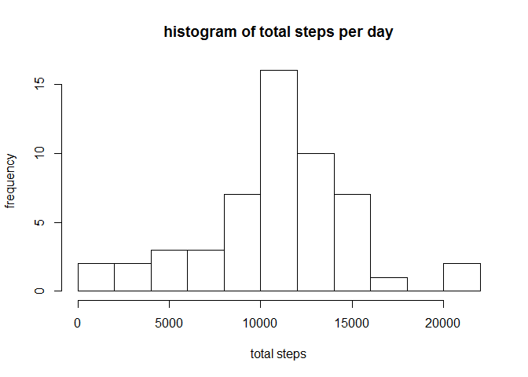
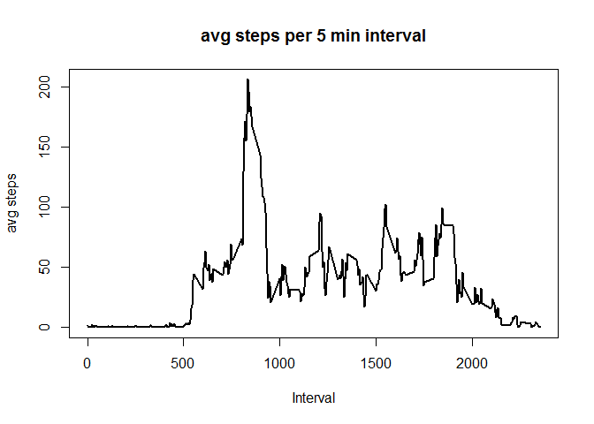
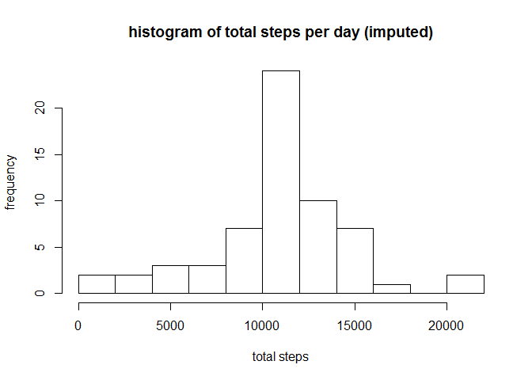
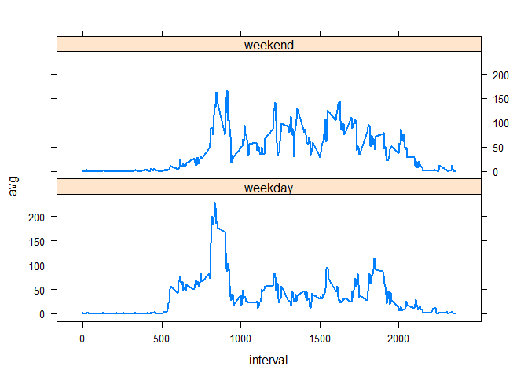

# Reproducible Research: Peer Assessment 1


### Loading and preprocessing the data

```r
library(dplyr)
library(lattice)
```

```
## Warning: package 'lattice' was built under R version 3.1.3
```
Read in the data and total the steps per day.

```r
data <- read.csv("activity.csv")
sumdata <- data %>% group_by(date) %>% summarise(total = sum(steps))
```


### What is mean total number of steps taken per day?
The calculated mean and median from the summary of the sumdata dataframe is shown below.

```r
summary(sumdata)
```

```
##          date        total      
##  2012-10-01: 1   Min.   :   41  
##  2012-10-02: 1   1st Qu.: 8841  
##  2012-10-03: 1   Median :10765  
##  2012-10-04: 1   Mean   :10766  
##  2012-10-05: 1   3rd Qu.:13294  
##  2012-10-06: 1   Max.   :21194  
##  (Other)   :55   NA's   :8
```

```r
hist(sumdata$total, breaks=10, main="histogram of total steps per day", xlab="total steps", ylab="frequency")
```

 

The histogram shows the mean at approximately 10,000, which is validated via the summary of the sumdata dataframe.

### What is the average daily activity pattern?
Average the activity data by interval across all days (remove NA values).

```r
intervaldata <- data %>% group_by(interval) %>% summarise(avgsteps = mean(steps, na.rm = TRUE))
```

Plot the average steps per interval.

 

The most active interval of the average daily activity is

```r
intervaldata[which.max(intervaldata$avgsteps),]
```

```
## Source: local data frame [1 x 2]
## 
##   interval avgsteps
## 1      835 206.1698
```

### Imputing missing values
The number of NAs in the dataset was calculated two ways:

```r
summary(data)[7,1] 
```

```
## [1] "NA's   :2304  "
```

```r
#or
nrow(data[data$steps=="NA",])
```

```
## [1] 2304
```

make a copy of original data, then replace all the NAs with the <b>interval means</b> calculated earlier.


```r
imputeddata <- data

for(i in 1:nrow(imputeddata)){
    if(is.na(imputeddata[i,1])){ # is.na(testdata$steps)  testdata$steps=="NA"
        imputeddata[i,1] <- intervaldata[intervaldata$interval==imputeddata[i,3],2]
    } 
}

sumimputeddata <- imputeddata %>% group_by(date) %>% summarise(total = sum(steps))
hist(sumimputeddata$total, breaks=10, main="histogram of total steps per day (imputed)", 
     xlab="total steps", ylab="frequency")
```

 

```r
summary(sumimputeddata)
```

```
##          date        total      
##  2012-10-01: 1   Min.   :   41  
##  2012-10-02: 1   1st Qu.: 9819  
##  2012-10-03: 1   Median :10766  
##  2012-10-04: 1   Mean   :10766  
##  2012-10-05: 1   3rd Qu.:12811  
##  2012-10-06: 1   Max.   :21194  
##  (Other)   :55
```
When replacing NA values with the interval average across all days, the mean and median of the imputed dataset is not different than what was originally calulated. (Compare both histograms, and dataframe summaries).

### Are there differences in activity patterns between weekdays and weekends?
Create Vector of weekdays for the summed imputed data, Factor the week days as either "weekday", or "weekend". Separate weekend activity and weekday activity into two dataframes.  Group each dataframe by interval and find the average steps for each interval.  Create a plot comparing average weekend activity with average weekday activity.


```r
imputeddatadays <- weekdays(as.Date(imputeddata$date))
imputeddatawithdays <- cbind(imputeddata,imputeddatadays)
dayclassification <- ifelse(weekdays(as.Date(imputeddatawithdays$date)) 
                            %in% c('Saturday','Sunday'), "weekend", "weekday")
imputeddatawithdays <- cbind(imputeddatawithdays[,c(-4)],dayclassification)


weekdayactivity <- imputeddatawithdays[imputeddatawithdays$dayclassification == "weekday",]
weekendactivity <- imputeddatawithdays[imputeddatawithdays$dayclassification == "weekend",]
avgweekdayactivity <- weekdayactivity %>% group_by(interval) %>% summarise(avg=mean(steps))
avgweekendactivity <- weekendactivity %>% group_by(interval) %>% summarise(avg=mean(steps))
```

 

Conclusion:  Using the imputed data and comparing the average weekend activity with the average weekday activity shows that each maximum is in the morning, with an increase in activity from approximately noon to evening.
